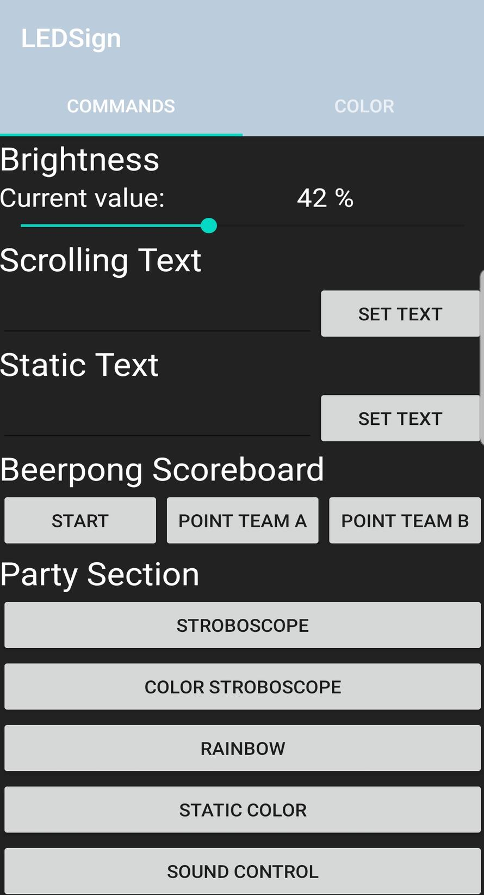
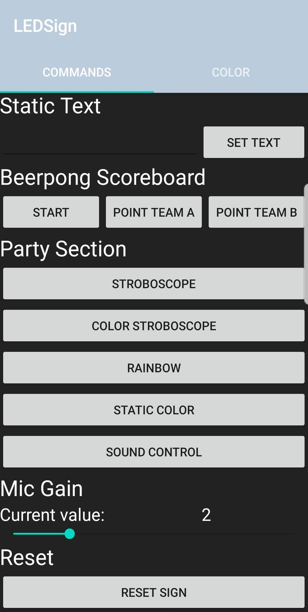
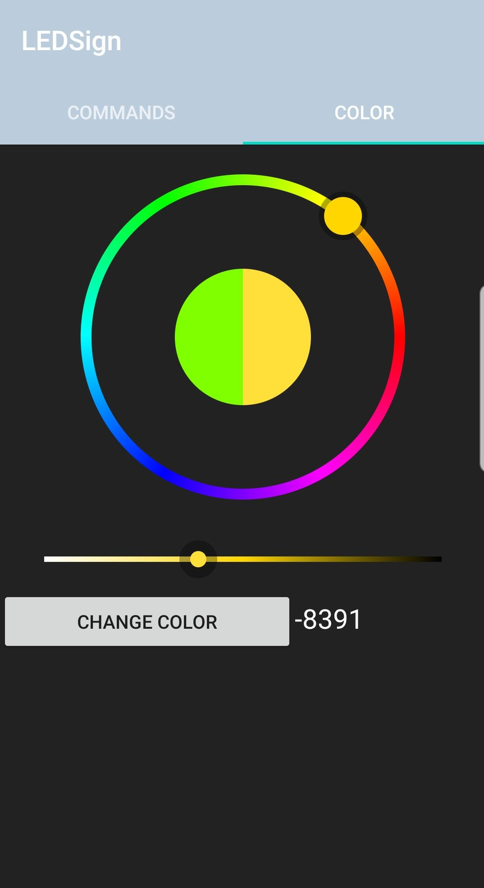

# LED Sign App

This repository contains the code for an Android App which controls the LED signs built in this project: [Building a Giant WiFi LED Sign](https://lars.carius.io/led_sign.html).
The corresponding firmware needed on the microcontroller of the LED sign can be found in the following Repo: [LED Sign Firmware](https://github.com/CariusLars/LEDSign_Firmware)

## Screenshots

